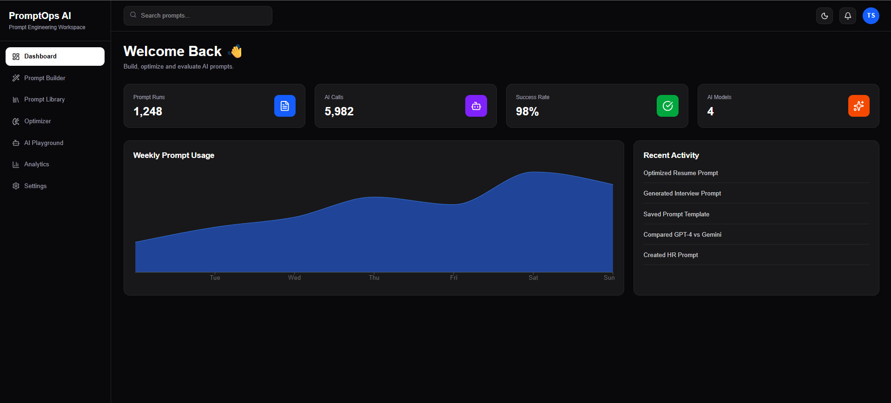
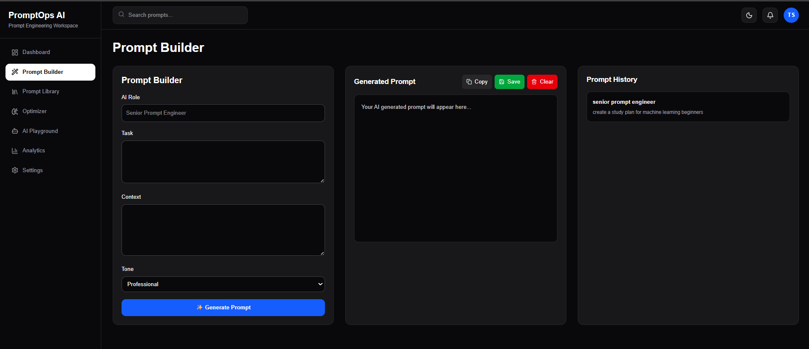
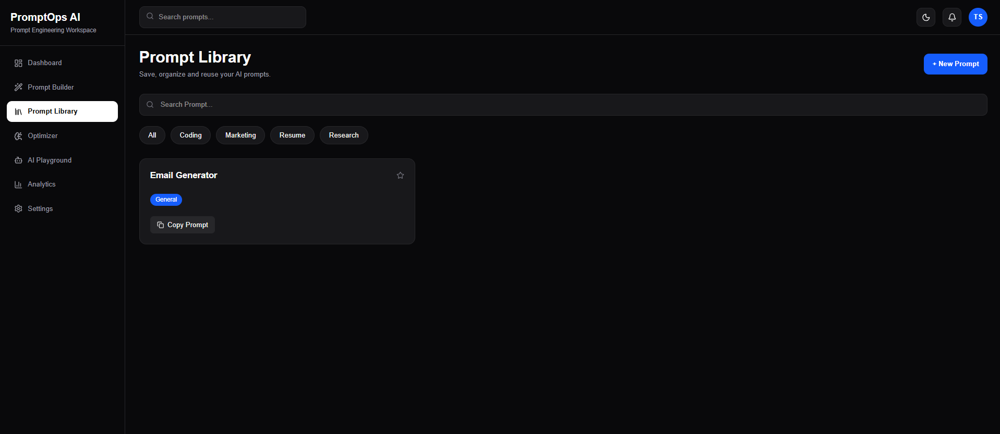
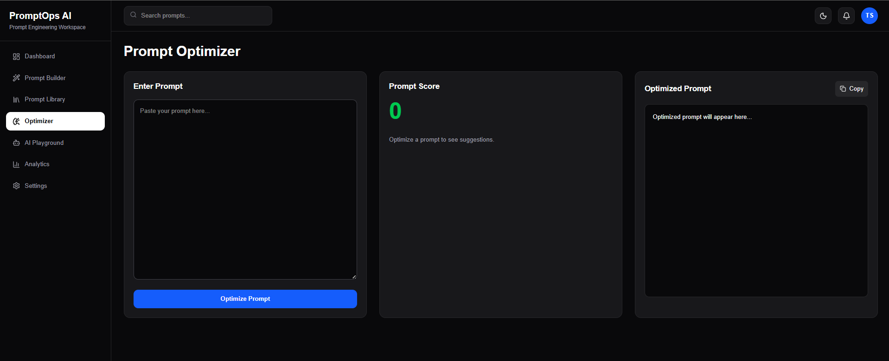
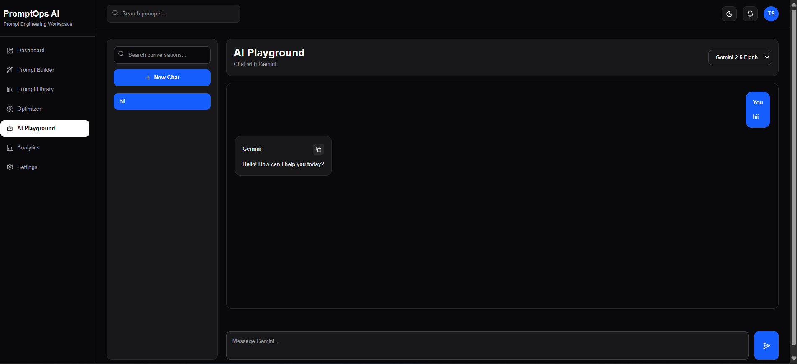
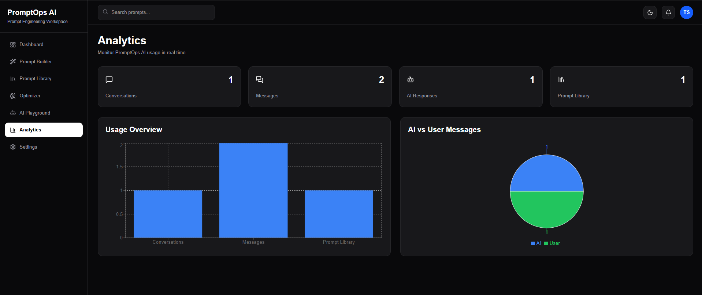
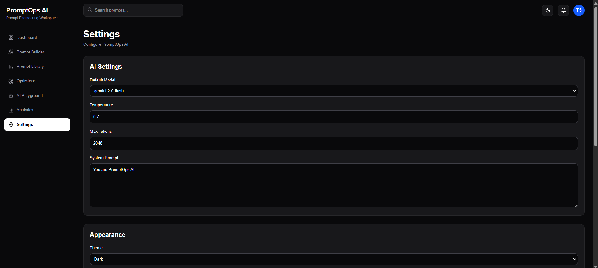

# PromptOps AI

PromptOps AI is a full-stack AI-powered Prompt Engineering Platform that helps users create, optimize, manage, test, and analyze AI prompts efficiently. The platform is designed to improve prompt quality and provide an organized workflow for AI prompt engineering.

---


## Project Overview

PromptOps AI provides an end-to-end environment where users can:

- Build AI prompts
- Optimize prompts
- Store prompts in a library
- Test prompts using Google Gemini
- Manage conversations
- Track analytics
- Export data

The application follows a modern full-stack architecture with a React frontend and FastAPI backend.

---

## Features

### Prompt Builder

- Create prompts
- Save prompts
- Generate AI prompts

### Prompt Library

- Store prompts
- View saved prompts
- Reuse prompts

### Prompt Optimizer

- Improve prompt quality
- Rewrite prompts
- Make prompts more structured

### AI Playground

- Test prompts
- Generate AI responses
- Experiment with prompt engineering

### Chat Management

- Create conversations
- Rename conversations
- Delete conversations
- Store chat history

### Analytics Dashboard

- Total Conversations
- Total Messages
- Prompt Statistics
- AI Usage Analytics

### Settings

- Application settings
- Data management
- Export functionality

---

## Tech Stack

### Frontend

- React
- Vite
- Axios
- CSS

### Backend

- FastAPI
- SQLAlchemy
- REST API

### Database

- SQLite

### AI Integration

- Google Gemini API

### Deployment

- Railway (Backend)
- Vercel (Frontend)

### Version Control

- Git
- GitHub

---

## Project Architecture

```
React Frontend (Vercel)
        │
        ▼
FastAPI Backend (Railway)
        │
        ▼
Google Gemini API
        │
        ▼
SQLite Database
```

---

## Folder Structure

```
PromptOps-AI
│
├── backend/
│   ├── app/
│   ├── api/
│   ├── db/
│   ├── models/
│   ├── schemas/
│   ├── services/
│   └── main.py
│
├── frontend/
│   ├── src/
│   ├── public/
│   ├── package.json
│   └── vite.config.js
│
├── screenshots/
│   ├── dashboard.png
│   ├── prompt-builder.png
│   ├── prompt-library.png
│   ├── prompt-optimizer.png
│   ├── ai-playground.png
│   ├── analytics.png
│   └── settings.png
│
└── README.md
```

---

## Installation

### Clone Repository

```bash
git clone https://github.com/shubham055555/PromptOps-AI.git
```

```bash
cd PromptOps-AI
```

---

## Backend Setup

```bash
cd backend
```

Create virtual environment

```bash
python -m venv venv
```

Activate virtual environment

Windows

```bash
venv\Scripts\activate
```

Install dependencies

```bash
pip install -r requirements.txt
```

Run backend

```bash
uvicorn app.main:app --reload
```

---

## Frontend Setup

```bash
cd frontend
```

Install dependencies

```bash
npm install
```

Run frontend

```bash
npm run dev
```

---

## Environment Variables

Frontend (.env)

```env
VITE_API_URL=https://your-backend-url/api
```

Backend (.env)

```env
GEMINI_API_KEY=YOUR_GEMINI_API_KEY
```

---

## API Documentation

Swagger Documentation

```
https://your-backend-url/docs
```

---

## Deployment

### Frontend

Vercel

### Backend

Railway

---

## Screenshots

### Dashboard


### Prompt Builder


### Prompt Library


### Prompt Optimizer


### AI Playground


### Analytics


### Settings


---

## Future Improvements

- JWT Authentication
- PostgreSQL Database
- Docker Support
- CI/CD Pipeline
- Team Collaboration
- Multi AI Model Support
- Prompt Versioning
- User Authentication
- Role-Based Access Control

---

## Author

**Shubham Sharma**

B.Tech CSE (AI & ML)

AI Prompt Engineering Intern

GitHub

https://github.com/shubham055555

---

## License

This project is developed for educational and internship purposes.
